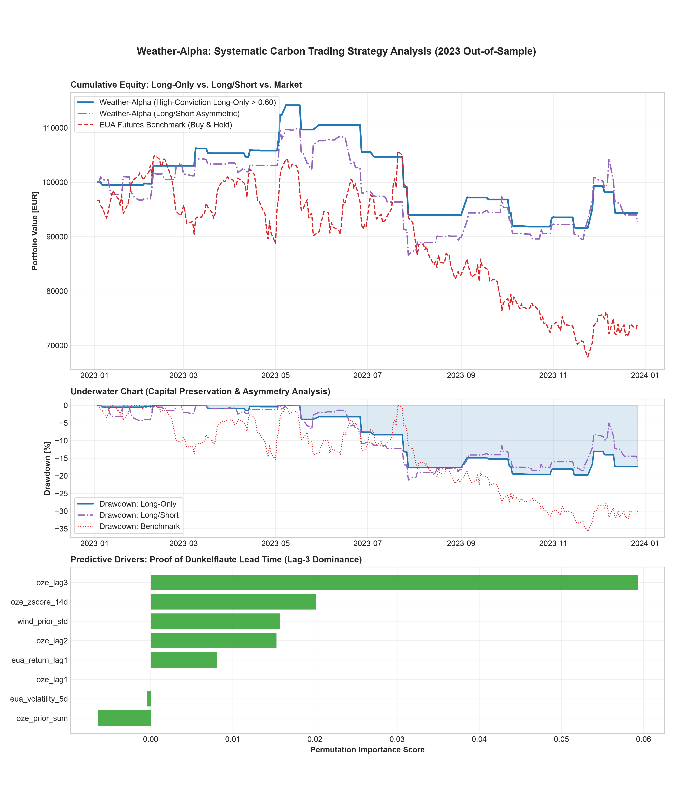

# Weather-Alpha: Systematic Carbon Emissions Trading via Renewable Energy Anomalies

A quantitative trading research framework and statistical arbitrage pipeline designed to test the **Dunkelflaute hypothesis** in European energy markets. The model predicts directional pricing spikes in EU Allowance (EUA) carbon futures contracts driven by German wind and solar generation intermittency.



---

## Key Quantitative Findings & Microstructure Insights
- **Asymmetric Impact (The Dunkelflaute Effect):** Utility peaker plants face mandatory carbon compliance constraints, triggering urgent spot/futures EUA purchases during low wind conditions (T+1 to T+3).
- **Lag-3 Predictive Dominance:** Permutation importance reveals that cumulative 3-day supply deficits (oze_lag3 and oze_zscore_14d) drive the strongest predictive alpha, reflecting grid dispatch lag.
- **Short Inefficiency:** Incorporating short positions on wind oversupply degraded risk-adjusted returns (Win Rate dropped from 48.28% to 45.05%) due to inventory retention by utilities and transaction drag.

---

## 2023 Out-of-Sample Performance (Bear Market Regime)

| Metric | Benchmark (EUA Buy & Hold) | Weather-Alpha (Long-Only > 0.60) | Weather-Alpha (Long/Short) |
| :--- | :--- | :--- | :--- |
| **Total Return** | **-25.94%** | **-5.66% (+20.28 pp. Alpha)** | -7.34% |
| **Annualized Volatility** | 32.54% | **14.95%** | 19.86% |
| **Max Drawdown** | -35.76% | **-19.78%** | -21.19% |
| **Market Exposure** | 100.0% (248 days) | **11.7% (29 days)** | 36.7% (91 days) |
| **Win Rate** | 46.37% | **48.28%** | 45.05% |

---

## 🚀 Reproduction Pipeline

**Option 1: Docker (Recommended)**
```bash
# Run test suite in isolated container
docker compose run test

# Execute end-to-end pipeline and generate tear sheet
docker compose up weather-alpha
```

**Option 2: Local Python Environment**
```bash
pip install -r requirements.txt
pytest
python generate_report.py
```
